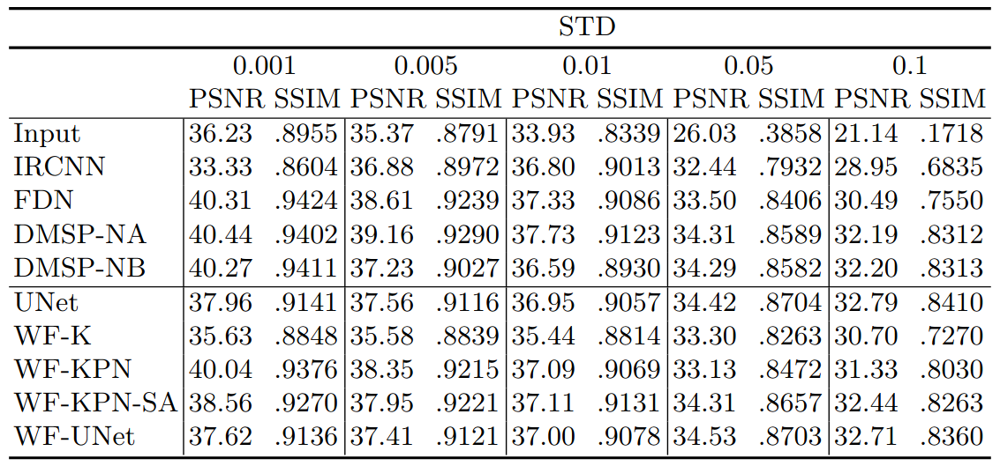
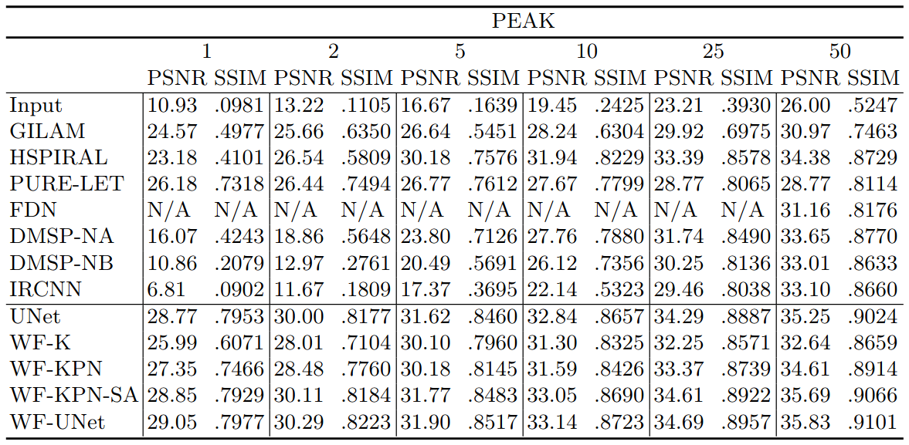

# Microscopy Image Restoration with Deep Wiener-Kolmogorov Filters

Implementation of the joint deblurring and denoising of microscopy images distorted with Gaussian or Poisson noise as described in the paper **"Microscopy Image Restoration with Deep Wiener-Kolmogorov Filters" (ECCV2020)**.

[Project page](https://vpronina.github.io/resources/project.htm)

### Dependencies

The code uses the external packages that can be installed with ```packagelist.txt```.

## Models

We provide models for joint denoising and deblurring based on deep learning techniques for the approximation of learnable prior information integrated into the Wiener-Kolmogorov filter:

- Wiener filter with learnable identical kernels (WF-K)
- Wiener filter with predictable kernels per-image (WF-KPN)
- Deconvolution with predictable gradient of regularizer per-image (WF-UNet)

We also provide the UNet that was used as the base of two algorithms.

## Evaluation

To have an idea about the models evaluation, you can run `Demo_Gaussian.ipynb` and `Demo_Poisson.ipynb` for the Gaussian and Poisson noise case respectively.

Run the following command to evaluate the model:

```python *.py file* --method *select algorithm* --test_std *select test std* --model_path ./models/ --visual 1 --use_gpu 1``` 

For example, to evaluate WF-UNet on Gaussian noise with std = 0.01, use GPU and save the output images run:

```python main-Gaussian.py --method WF_UNet --test_std 0.01 --model_path ./models/ --visual 1 --use_gpu 1``` 

To evaluate WF-K on Poisson noise with peak = 25 and do not save the output images and do not use GPU run:

```python main-Poisson.py --method WFK --test_scale 25. --model_path ./models/ --visual 0 --use_gpu 0```

## Hyperparameters

```
usage: main-Gaussian.py [-h] [--method METHOD] [--model_path MODEL_PATH]
                        [--test_std TEST_STD] [--visual VISUAL]
                        [--use_gpu USE_GPU]

Image deconvolution with trainable algorithms

optional arguments:
  -h, --help            show this help message and exit
  --method METHOD       Define algorithm to run
  --model_path MODEL_PATH
                        Path to the models
  --test_std TEST_STD   Standard deviation of the Gaussian noise
  --visual VISUAL       Save (visual=1) or not (visual=0) evaluated results
                        during test
  --use_gpu USE_GPU     Use GPU (use_gpu=1) or CPU (use_gpu=0) for evaluation


```

```
usage: main-Poisson.py [-h] [--method METHOD] [--model_path MODEL_PATH]
                       [--visual VISUAL] [--use_gpu USE_GPU]
                       [--test_scale TEST_SCALE]

Image deconvolution with trainable algorithms

optional arguments:
  -h, --help            show this help message and exit
  --method METHOD       Define algorithm to run
  --model_path MODEL_PATH
                        Path to the models
  --visual VISUAL       Save (visual=1) or not (visual=0) evaluated results
                        during test
  --use_gpu USE_GPU     Use GPU (use_gpu=1) or CPU (use_gpu=0) for evaluation
  --test_scale TEST_SCALE
                        Peak value for the ground truth image rescaling to
                        simulate various levels of Poisson noise
                        
```

## Note

Below there are tables with the results obtained with the longer training of our models:

### Gaussian noise



### Poisson noise


